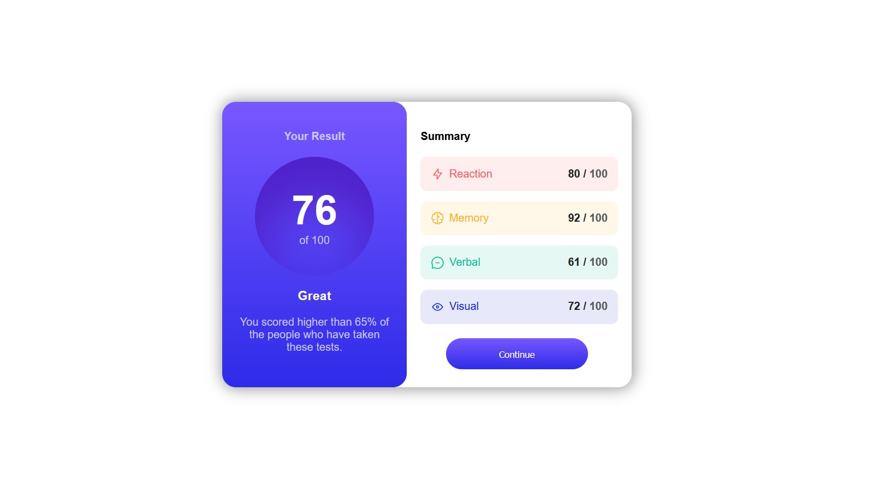
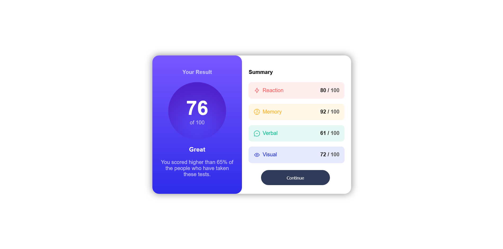
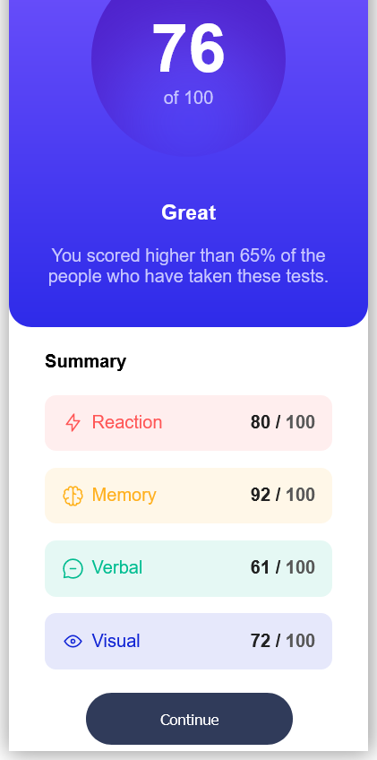

# Frontend Mentor - Results summary component solution

This is a solution to the [Results summary component challenge on Frontend Mentor](https://www.frontendmentor.io/challenges/results-summary-component-CE_K6s0maV). Frontend Mentor challenges help you improve your coding skills by building realistic projects. 

## Table of contents

- [The challenge](#the-challenge)
- [Screenshot](#screenshot)
- [Links](#links)
- [Built with](#built-with)
- [Author](#author)

### The challenge

Users should be able to:

- View the optimal layout for the interface depending on their device's screen size
- See hover and focus states for all interactive elements on the page

### Screenshot

- Different Views

### Links

- Live Site URL: [Github Pages](https://your-live-site-url.com)

### Built with

- Semantic HTML5 markup
- CSS custom properties
- Flexbox

## Author

- Github - [AlphaVamp](https://github.com/AlphaVamp)
- Frontend Mentor - [Paresh2421](https://www.frontendmentor.io/profile/Paresh2421)
- LinkedIn - [Paresh Nair](https://www.linkedin.com/in/paresh-nair-1987b4254)
